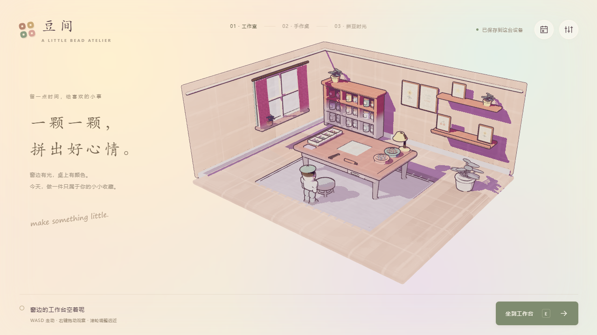
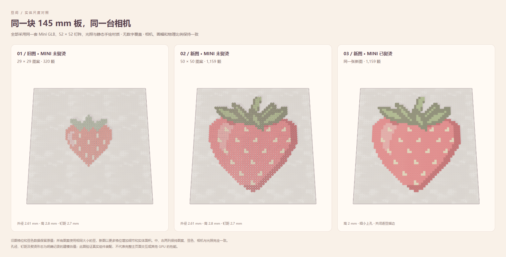

# Fuse Beads MS · 豆间

独立的网页拼豆工作室，用来快速迭代数字拼豆玩法、微缩场景与手绘渲染。纯前端、本地存档，使用 Three.js + TypeScript + Vite；不需要 Cocos、父项目或后端。



## 运行

需要 Node.js 22.12+ 和支持 WebGL 2 的现代浏览器，本机使用 Node.js 24.13.0。

```powershell
git clone git@github.com:fsrshaorong/fuse_beads_ms.git
cd fuse_beads_ms
npm ci
npm run dev
```

打开 <http://127.0.0.1:5173/>。六张美术纹理和 Blender GLB 已包含在仓库里，`prepare:assets` 只检查本地文件。运行时不连接参考网站、CDN 或游戏服务器，也不需要安装 Blender。

```powershell
npm run build
npm run preview
```

生产预览为 <http://127.0.0.1:4173/>。`dist/` 可由静态 Web 服务承载；不支持直接双击 HTML。开发服务只监听本机。

## 玩法

- 工作室：WASD 走动，右键拖动观察，滚轮调整距离；走近工作台按 E 坐下。
- 桌面：点击棋盘或向前滚轮，沿同一摄影机平滑进入拼豆；进入的第一次点击不会落豆。
- 拼豆：15 张图案全部使用 2.6 mm Mini 豆与 52×52 钉板。新访客从 50×50「莓果小物」开始，1159 颗、6 色、背景留空。旧 14 张图案和已有存档保留原格数与颜色，不放大复制。数字选色，点击或连续拖动放豆；B 放豆、X 擦除，支持整笔撤销/重做。错色保留目标编号。
- 近景：滚轮连续缩放；WASD 或空格拖动平移。拉远到全板后停稳，再向后滚动返回桌面；E 起身。
- 熨烫：图案正确后按住拖动熨斗，经过的豆逐格压低、缩孔、摊开上缘，松开暂停，完成后收进本地收藏与陈列架。
- 美术：右上按钮调整笔触、暖光、阴影及描边粗细；房间与未熨烫豆保留轮廓，成品关闭逐豆描边，让融合后的色面更连贯。“恢复参考效果”恢复材质与描边默认值。模型、笔触和描边没有时间抖动。

存档键为 `fuse-beads.web-playground.v1`，兼容拆分前同源页面的本地作品。保存各图案草稿、选色、熨烫覆盖与成品；刷新从工作室恢复。撤销历史仅限当前会话。损坏存档保留原值并暂停覆盖。

## 迭代入口

| 内容 | 文件 |
| --- | --- |
| 制作动作、只读状态与存档校验 | `src/App/WorkshopApplication.ts` |
| 数字填色、整笔历史与三层交互规则 | `src/Core/Gameplay/` |
| 世界、桌面、拼豆的连续镜头 | `src/Scene/WorkshopCamera.ts` |
| 家具、人物、场景色板与建模 | `src/Scene/WorkshopEnvironment.ts` |
| 固定毫米比例、Blender 模型、实例化拼豆 | `src/Rendering/BeadDimensions.ts`、`BeadModels.ts`、`BeadBoardView.ts` |
| 参考配置、笔触与光影公式 | `src/Rendering/ReferenceProfile.ts`、`PainterlyShaders.ts`、`PainterlyMaterials.ts` |
| 五盏灯、阴影与颜色输出 | `src/Rendering/PainterlyLighting.ts` |
| 家具、人物和实例化拼豆的稳定描边 | `src/Rendering/PainterlyOutline.ts` |
| 熨斗和成品展示 | `src/Scene/FinishingView.ts` |
| 界面与输入 | `src/Ui/WorkshopHud.ts`、`src/main.ts`、`src/styles.css` |

渲染对照说明见 [docs/RENDERING.md](docs/RENDERING.md)，迁移与资产来源见 [docs/PROVENANCE.md](docs/PROVENANCE.md)。场景布局是拼豆工作室，渲染以指定参考页面的实际公式和参数为准。

拼豆由 Blender 参数化生成，网页统一加载 Mini 未熨烫和成品网格：未熨烫外径 2.61 mm、高 2.8 mm，钉板外宽 145 mm、52×52 钉位、节距 2.7 mm。所有图案、桌面散豆和收藏使用同一规格，换图不改变豆径或板大小。旧图仍按原格位展示，因节距变小，其实际面积比旧 Midi 版本更小。公开尺寸、孔径和钉距等估值，以及重建方法见 [拼豆模型说明](docs/BEAD_MODELS.md)。

新草莓的有效轮廓为 40×44，增加双色叶脉、弧形高光和 19 组奶油籽。旧草莓有效轮廓为 21×24；只移动相机或把旧格复制成更小的豆子，不能增加这些图案细节。新内容使用独立 ID 和色号，旧图案、颜色与存档签名保持原值。



上图由独立组件自检生成，加载网页使用的真实 Mini GLB、光照和材质；三列依次为旧 29×29 图案、新 50×50 图案及新图成品，保持相同的 52×52 物理板、相机与光照，不是完整工作室页面截图。

当前 `.blend` 源文件为 `assets/models/mini-bead-kit.blend`，网页只加载 `public/models/mini-bead-kit.glb`。旧 `bead-kit.blend`、`bead-kit.glb` 和 Midi 生成器保留为建模档案，不用于运行时。房间家具仍为程序化美术样板；当前未做模型 LOD、音效、揭纸动画、真实热力/熔接模拟或成品自由旋转。桌面键鼠是当前验收目标，触屏未完成验收。

## 验证

```powershell
npm test
npm run build
npm run --silent scenario -- finish
npm run selfcheck
npm run selfcheck:rendering
npm run selfcheck:outline
npm run selfcheck:beads
npm run selfcheck:mini
```

`selfcheck` 需先启动开发服务及安装 Chrome；可用 `ATELIER_BROWSER` 指定浏览器路径，`ATELIER_URL` 指定服务地址。测试使用独立浏览器 context，不改当前试玩页存档。截图与报告保存在忽略目录 `artifacts/`。

渲染自检会联网获取原站着色代码作为独立对照；已有缓存后可用 `npm run selfcheck:rendering -- --offline`。`selfcheck:beads` 验证旧 29 格草莓在统一 Mini 规格下的尺寸、拖动、熨烫、恢复和收藏回归。`selfcheck:mini` 用独立组件场景验证不同格数图案共用 Mini 的真实 GLB、着色和格位命中，不加载 `main` 或 HUD；它与主应用完整流程测试的范围不同。截图和报告用于检查实际效果，应用本身不需要该网络访问。

公开 `window.beadsAtelier.dispatch/read/projectCell/metrics` 供本地工具使用；dispatch 与 UI、CLI 共用 Application 入口。纯值测试覆盖作品往返、整笔历史、存档、熨烫恢复和镜头边界；浏览器测试覆盖真实键鼠完整路径与四个桌面尺寸。
