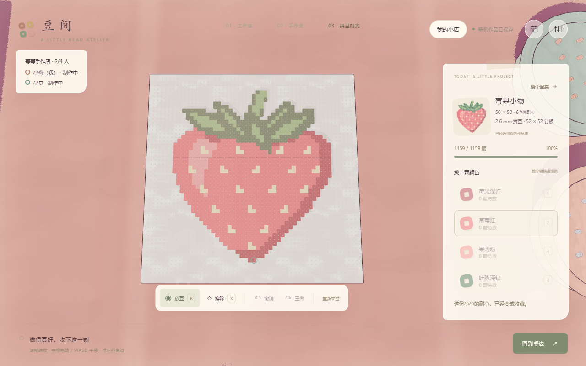

# 四人合作拼豆

`5173` Three.js 工作室已接入常驻 Node.js 后端和真实 WebSocket 联机。单机仍经 `WorkshopApplication`；合作模式经 `OnlineWorkshopApplication` 把权威房间状态接入同一套棋盘、镜头、工具与收藏界面。公网版本已部署到 https://101.132.62.222/ ，运行与更新见 [部署说明](DEPLOYMENT.md)。

场景采用四人手作店：地面面积扩大至约 1.7 倍，完整室内建筑按各自镜头动态隐藏遮挡墙顶；四人共拼一块图案，默认 50×50 草莓，保留统一 2.6 mm Mini、52×52 钉板、美术管线与无抖动效果。

## 本机启动

后端需要 **Node.js 24+**，使用内置 `node:sqlite`。本机验证版本为 24.13.0；它可能输出 SQLite ExperimentalWarning。单机前端原有启动方式保持不变。

```powershell
npm ci
npm run start:server
```

默认监听 `http://127.0.0.1:2567`，只在本机提供服务。开发时可以使用 `npm run dev:server` 自动重启。`GET /health` 返回服务存活状态和协议版本；这不是数据库健康/生产就绪检查。

另开终端执行 `npm run dev`，打开 `http://127.0.0.1:5173/`。默认客户端连接页面同源 `/socket.io`，Vite 开发代理转到 `2567`，无需在页面配置后端地址。

1. 右上「一起拼豆」，填写昵称与店名，选择「开一间小店」。
2. 「我的小店」内复制邀请链接，或点击「新玩家打开测试」打开独立身份的标签页。另一端也可粘贴链接或房间编号加入。
3. WASD 按当前摄像机方向走近空座位，按 E 入座，进入拼豆；各人选色、镜头和撤销独立。
4. 拼满正确图案后领取熨斗，按住拖动。当前持有人可放下，其他人接手，完成作品出现在参与者收藏中。
5. 房主选择新图或历史草稿，在线成员一致同意后切换。离开小店会回到原来的单机草稿。

本机页面邀请链接的 `127.0.0.1` 仅能用于同一台电脑；公网网页生成的 HTTPS 邀请链接可供朋友访问。采用独立后端时，构建前可设 `VITE_MULTIPLAYER_URL`，或由同源 Web 服务代理 `/socket.io`；默认 Vite 代理只用于开发服务器。



第一次启动自动创建 `data/multiplayer.sqlite`。目录与 SQLite 数据、WAL 文件已经加入忽略规则，不要提交到 Git。不要复制一个正在写入的单独 `.sqlite` 文件当作完整备份；本地人工备份先正常停止服务，再复制数据库目录。

| 环境变量 | 默认值 | 用途 |
| --- | --- | --- |
| `MULTIPLAYER_PORT` | `2567` | 后端端口 |
| `MULTIPLAYER_HOST` | `127.0.0.1` | 监听地址 |
| `MULTIPLAYER_DB` | `data/multiplayer.sqlite` | SQLite 文件路径 |
| `MULTIPLAYER_ORIGINS` | 本机 `5173`、`4173` 开发来源 | 逗号分隔的浏览器来源白名单 |
| `VITE_MULTIPLAYER_URL` | 页面同源地址 | 可选的前端后端地址，构建时注入 |

服务使用 Socket.IO 4.8.3 的 WebSocket transport，不能用原生 WebSocket 客户端直接发送 JSON 代替 Socket.IO 协议。

## 运行测试

```powershell
npm run test:multiplayer
npm run selfcheck:multiplayer
npm run selfcheck:multiplayer-browser
npm test
npm run build
```

测试自行启动 `127.0.0.1` 随机空闲端口上的后端，使用临时 SQLite 文件和独立客户端，不需要预先启动 `2567`，也不会连接现有浏览器、读取页面存档或修改正式数据库。

- `test:multiplayer`：14 项测试，含四名实际 Socket.IO 客户端同时修改棋盘、座位、身份接替、房间隔离、冲突、去重、个人撤销/重做、断线、丢补丁恢复、换图投票、旧草稿恢复、1159 颗完整合作熨烫与收藏。
- 重启测试覆盖正常重启和强制结束测试专用子进程；后者在进程被结束前已收到操作确认，不依靠退出事件补存档。
- 持久化测试包括提交前故障与事务执行中唯一约束失败，验证回滚后棋盘和操作回执一致。
- `selfcheck:multiplayer`：默认 25 房、100 个真实客户端；每房一名写入者和三名订阅者，共提交 500 条操作。逐个检查客户端接收补丁后得到的格位与版本，而非靠最后重新下载棋盘掩盖广播问题。
- 报告写入 `artifacts/multiplayer/load-report.json`。可以通过 `MULTIPLAYER_LOAD_ROOMS` 调整到 1～50 房。
- `Tests/OnlineWorkshopApplication.test.ts`：验证即时拖动预览、持久待确认队列、超时后的请求不可变、快速连续换色与个人撤销、服务端位置更新不会截断本地起身镜头。
- `selfcheck:multiplayer-browser`：自行启动随机后端与 `5191` 隔离前端，两个独立 Chrome context 实际加载 `main.ts`，验证 UI 创建/加入、分别入座和独立镜头、真实鼠标放豆、个人撤销/重做、离线恢复、刷新恢复、真实熨斗输入、熨斗交接、共同收藏、退出后的单机存档隔离，以及反向镜头墙体切换。辅助协议客户端准备其余格位，剩余熨烫覆盖通过应用入口推进。截图和报告在 `artifacts/multiplayer-browser/`；可用 `MULTIPLAYER_BROWSER_PORT` 修改测试前端端口。

并发自检是本机传输、持久化与广播检查，不等于公网延迟测试、浏览器帧率测试或生产容量承诺。多人真实页面流程由上述浏览器自检独立验证；原单机流程仍由 `npm run selfcheck` 验证。

2026-09-07 本机验收：41 项测试、生产构建、原单机主页面、双浏览器联机流程、缓存原站 Shader 对照与描边检查通过。并发检查为 25 房、100 客户端、500 条确认操作、100 份副本一致，确认延迟 P95 约 222 ms；这是本次本机运行数据。

## 文件边界

| 文件 | 职责 |
| --- | --- |
| `src/Core/Multiplayer/RoomState.ts` | 引擎无关共享作品规则，逐格版本与个人历史、熨烫状态 |
| `shared/MultiplayerProtocol.ts` | 协议 1、运行时严格校验、请求/回执/快照/补丁类型 |
| `server/RoomService.ts` | 房间成员授权、串行命令处理、投票、移动和座位、广播 |
| `server/SqliteStore.ts` | 匿名身份、草稿、事务、操作去重和共同收藏 |
| `server/server.ts` | Socket.IO、请求大小限制、来源检查、连接与消息限流 |
| `server/main.ts` | 本地后端启动和退出 |
| `src/Networking/MultiplayerClient.ts` | 连接、自动重入房间、补丁应用、版本缺口重新同步 |
| `src/App/OnlineWorkshopApplication.ts` | 逐格即时预览、持久待确认队列、选色与独立交互状态、位置预测和校正 |
| `src/Ui/RoomPanel.ts` | 创建、加入、邀请、连接状态、成员、换图投票、历史草稿 |
| `src/Scene/PartnerView.ts` | 伙伴人物、姓名、坐姿、位置插值与近景光标 |
| `src/Core/Multiplayer/WorkshopLayout.ts` | 前后端共用的房间尺度、桌面碰撞、四个座位和出生点 |

持久化接口目前是同步接口，与单进程房间串行执行配合。未来切 PostgreSQL 时，需要同时把存储调用改为异步，并增加每房命令队列；不能在 `await` 期间允许两条命令基于同一旧状态同时提交。本阶段没有实现 PostgreSQL 或多实例房间路由。

## 独立协议客户端示例

```ts
import { MultiplayerClient } from './src/Networking/MultiplayerClient';

const client = new MultiplayerClient('http://127.0.0.1:2567', { nickname: '豆豆' });
client.onSession = (session) =>
{
    // 宿主保存 token 供下次访问恢复身份；不要展示或写入日志。
};
client.onState = (snapshot) =>
{
    // 渲染快照。选色、光标、镜头仍分别属于各自玩家。
};
await client.connect();
const room = await client.create({ opId: crypto.randomUUID(), name: '一起拼草莓' });
// 另一客户端：await client.join(room.roomId);
await client.seat(0);
const index = room.pattern.targetNumbers.findIndex(Boolean);
await client.command({
    opId: crypto.randomUUID(), roomId: room.roomId, workId: room.work.id,
    type: 'paint', strokeId: crypto.randomUUID(),
    edits: [{ index, color: room.pattern.targetNumbers[index], expectedVersion: room.work.cellVersions[index] }]
});
```

创建房间返回的 `roomId` 是当前邀请标识，页面邀请链接使用 `?room=...`。已提供邀请界面，尚无短房间码或公开大厅。各玩家需使用不同 token；同一 token 新建连接会接替原连接，而不是占用两个座位。「新玩家打开测试」使用 `?guest=new` 显式创建独立身份。

前端宿主在 `sessionStorage` 的 `fuse-beads.online-session.v1` 和 `fuse-beads.online-outbox.v1` 保存每个标签页的身份、房间及未确认操作；刷新会自动恢复。关闭标签页后匿名身份不保证保留，尚无账号或跨设备找回功能。适配器自身不读写浏览器存储。联机从服务器草稿开始，单机 `localStorage` 作品不会自动上传或被联机覆盖。

## 协议

握手：`{ protocolVersion: 1, nickname?: string, token?: string }`。昵称 1～24 字符。首次连接生成 256 位随机 token；数据库仅存其 SHA-256。携带未知 token 会拒绝，不会默默创建新身份。

所有有状态请求必须提供回调，结果统一为 `{ ok: true, value }` 或 `{ ok: false, code }`。缺少回调不会执行修改。身份以连接认证结果为准，请求不能指定别人的玩家 ID。

| 客户端事件 | 请求 | 成功值 |
| --- | --- | --- |
| `session:get` | 无 | 身份与恢复凭证 |
| `room:create` | `opId, name, patternId?` | 完整房间快照 |
| `room:join` | `roomId` | 完整房间快照 |
| `room:leave` | 无 | `null` |
| `room:snapshot` | 无 | 当前房间完整快照 |
| `room:drafts` | 无 | 当前房间最近至多 100 条记录中的历史未完成草稿摘要 |
| `room:command` | 见下表 | `opId, version, skippedIndices, duplicate` |
| `player:input` | `sequence, directionX, directionZ, selectedColor, cursor` | `null` |
| `player:seat` | `seat: 0..3` 或 `null` | `null` |
| `collection:list` | 无 | 此身份最近至多 256 件共同作品 |

每个作品命令都有 `opId, roomId, workId, type`。`opId` 在玩家身份内唯一；用同一个 ID 改变内容会被拒绝。旧命令成功回执可在重连/重启后重查，但新操作必须使用当前作品 `workId`。

| 命令 type | 额外字段 | 规则 |
| --- | --- | --- |
| `paint` | `strokeId, edits: [{ index, color, expectedVersion }]` | 每批 1～128 个不同格位；0 为擦除；空背景禁止放豆；过期格位跳过，其余独立应用 |
| `endStroke` | 无 | 连续批次相同 `strokeId` 组成一笔，松手结束 |
| `undo` / `redo` | 无 | 自己最近 30 笔，逐格条件回滚，跳过他人修改 |
| `acquireIron` | 无 | 图案完全正确才能开始；获得 5 秒持有凭证 |
| `iron` | `leaseToken, indices` | 每批至多 128 格；验证持有人和有效期，操作续期 |
| `releaseIron` | `leaseToken` | 保留覆盖并允许别人接手 |
| `proposePattern` | `patternId` | 房主提出新图/重开；所有在线投票者同意才切换 |
| `proposeDraft` | `draftId` | 房主提出恢复房间历史草稿，同样投票 |
| `votePattern` | `proposalId, approve` | 一票拒绝取消提议；提议 30 秒到期 |

创建和换图均不提供已经下架的五款“轻松小图案”。图案内容签名在恢复时校验，客户端不能提供任意图案覆盖官方目标数据。

提议期间冻结作品操作；成员加入或离开会取消提议，避免已同意的参与者面对变化后的内容。恢复历史草稿产生新的作品代次，保留格位、熨烫覆盖与参与者，清空操作历史及格位版本；迟到的旧代次消息不能修改它。

服务端事件：

- `room:snapshot`：加入、成员/房主变化、切图等结构变化。包含 pattern、公开 work、版本、持有凭证、提议和玩家，以及各玩家 `canUndo/canRedo` 标志；不包含私有撤销历史内容或其他人的恢复 token。
- `room:patch`：持久命令产生的连续版本及改变的格位、覆盖和制作阶段。
- `room:presence`：20 Hz 可丢弃的位置/光标状态。
- `session:replaced`：同身份的新连接接替旧连接。

## 一致性与恢复

每个作品命令先修改一份候选状态，再以一个 SQLite 事务保存房间、作品、去重回执和可能产生的成品/收藏关联。事务提交后才替换内存状态并广播、确认。失败则丢弃候选状态。数据库采用 WAL 与 `synchronous=FULL`；当前机器磁盘损坏等灾难恢复仍需独立备份。

整笔撤销不是整板快照覆盖。每个修改保存原值、原版本、新值和写入版本。只撤回仍属于该笔操作的格位；自己连续撤销可以沿历史链推进，别人的改写即使改回相同颜色也不会被误认为未修改。

版本缺口直接下载全量快照，当前没有实现逐条历史事件补发。2500 格板面适合这个初始策略。适配器保留服务端确认状态；应用单独叠加待确认格位，鼠标放豆即时可见，收到确认后移除预览。若格位已有伙伴的新版本，保留对方结果并提示跳过数量。连续修改自己尚未确认的同一格时，只沿自己确认的写入推进后续未发送意图的版本，不越过伙伴的新修改。

连接断开立即停止移动并释放熨斗；座位保留 60 秒。房主转交在线成员。最后一人离开后，保留期结束卸载房间内存，作品仍在数据库。重启后位置回到出生点、需重新入座，作品、个人操作历史和收藏恢复；进行中的笔画被收束，熨斗需重新领取。

客户端对确认超时重试一次，始终使用原 ID 和原请求；应用队列保留未确认请求继续重试，并在每次变化时保存到标签页存储。已发送过的请求内容不可修改，后续拖动会追加新的批次。刷新时恢复原请求继续确认；过期作品代次或已结束笔画被拒绝并提示。检测到掉线时拒绝新修改，避免离线积累的笔画在别人继续制作后批量覆盖。未确认队列上限 256 条，每批至多 128 格；离开房间前必须完成确认。

## 移动与当前边界

客户端仅提交水平移动方向，服务器以自己的时钟按 20 Hz 推进，速度 2 单位/秒，单步时间上限 0.1 秒，250 毫秒无新输入自动停下。序号过期的输入忽略。客户端可以根据自己的相机换算方向，但不能提交时间、位置或速度。

场景和后端已共用 `WorkshopLayout`：可走动半宽 5.5、半深 4.2，中央桌面碰撞半宽 2.1、半深 1.35；前后座位为 `(0, ±1.65)`，左右座位为 `(±2.35, 0)`。坐下要求距离在 1.5 单位内，座位互斥；制作需要入座。新玩家优先使用未被占据的出生点。客户端按共享规则即时预测移动，收到服务端位置后校正；伙伴位置采用插值，镜头不参与同步。

每连接每秒最多处理 100 条有回执消息，每条消息最大 64 KiB；每身份最多创建 20 个房间。该版本面向本机开发与私下联调，尚未实现正式账号、跨设备找回身份、公开匹配、封禁、房间踢人、作品删除、操作记录清理、分布式房间所有权或生产级入口防滥用。

当前本机网页和联机后端均可直接试玩。尚未验收移动触屏、公网弱网环境、长时间运行和多服务器部署；这些边界与已完成的本机多人页面测试分别记录。
